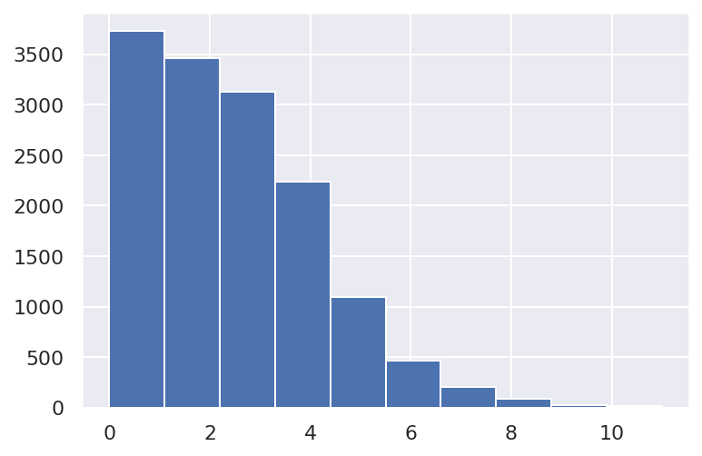
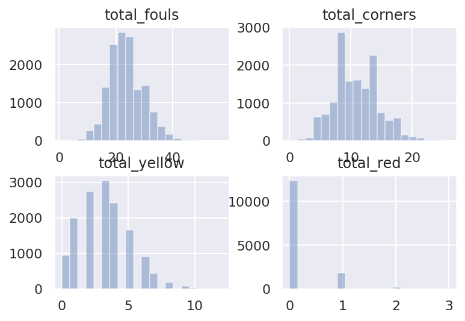
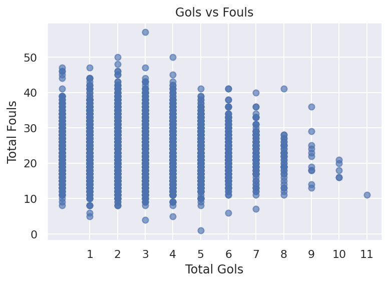
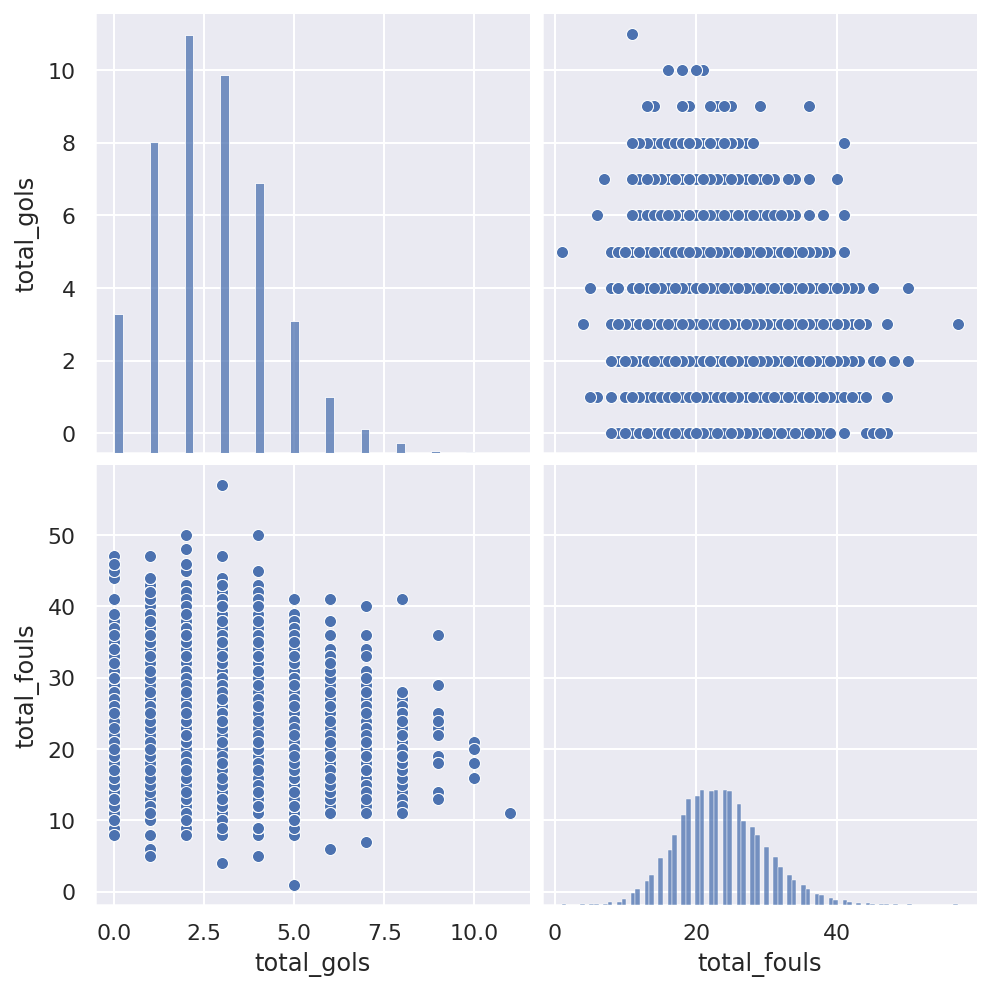
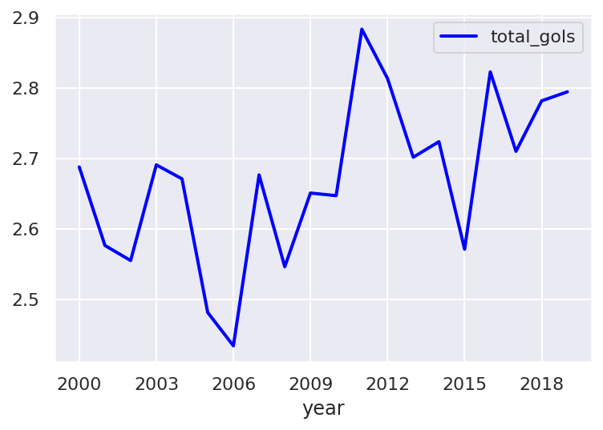
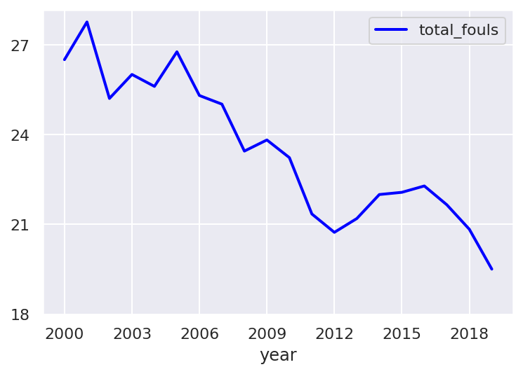
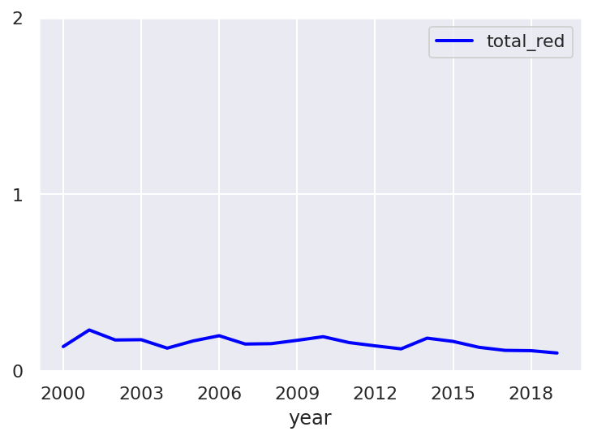
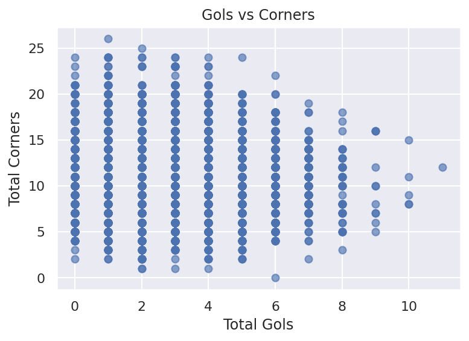
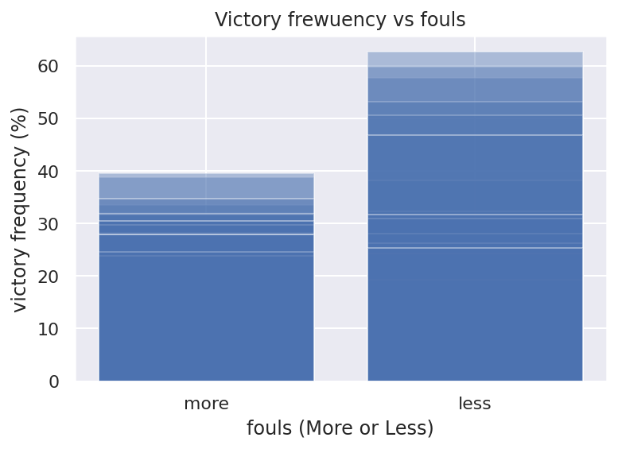

> Machine Learning Foundation
>
> Premier League Season stats
>
> Premier League
>
> The Premier League, often referred to as the English Premier League or
> the EPL (legal name: The Football Association Premier League Limited),
> is the top level of the English football league
>
> system. Contested by 20 clubs, it operates on a system of promotion
> and relegation with the English Football League (EFL). Seasons run
> from August to May with each team playing 38 matches(playing all 19
> other teams both home and away). Most games are played on Saturday and
> Sunday afternoons.
>
> The competition was founded as the FA Premier League on 20 February
> 1992 following the decision of clubs in the Football League First
> Division to break away from the Football League, founded in1888, and
> take advantage of a lucrative television rights sale to Sky.From 2019
> to 2020, the league\'s accumulated television rights deals were worth
> around £3.1 billion a year, with Sky and BT Group
>
> securing the domestic rights to broadcast 128 and 32 games
> respectively. The Premier League is a corporation where chief
> executive Richard Masters is responsible for its management, whilst
> the
>
> member clubs act as shareholders.Clubs were apportioned central
> payment revenues of £2.4 billion in 2016--17, with a further £343
> million in solidarity payments to English Football League (EFL)clubs.
>
> Dataset description
>
> A dataset which contains a list of games, results and some numbers
> about the games of premier league, the england soccer league.
>
> Features list
>
> Season: **string (years of the season where the games take place)**
> \</b\>
>
> Game: **int (number of each game at each team)**\
> Unique ID: **string (unique id of each game)**
>
> Date: **string (date in dd/m/yyyy format)**
>
> Team: **string (principal team name)**\
> Opponent: **string (visitor team name)**
>
> Team G: **int (principal team goals)**\
> Opp G: **int (visitor team goals)**
>
> Win Loss: **string (status of principal team result, win, loss,
> draw)**
>
> Points: **int (goals of game)**\
> Referee: **string (referee name of game)**
>
> Team S: **int (principal team shoots)**\
> Opp S: **int (visitor team shoots)**
>
> Team Fouls: **int (principal team fouls)**
>
> Opp Fouls: **int (visitor team fouls)**\
> Team Corner: **int (principal team corners)**
>
> Opp Corner: **int (visitor team corners)**\
> Team Yellows: **int (principal team yellow cards)**
>
> Opp Yellow: **int (visitor team yellow cards)**
>
> Team Red: **int (principal team red cards)**\
> Opp Red: **int (visitor team red cards)**
>
> Initial Plan
>
> Explore and measure the quality and quantity of data, applying data
> cleansing and feature engineering techniques to gain insights and
> formulate hypotheses about the number of goals in a game.
>
> using data analysis techniques the object of this exploratory research
> is to understand variations and trends that can provide us with better
> clarity on how the results can be influenced according to
>
> the statistics of each game
>
> Initial Example of initialization code

+-----------+-------------------------------------------------------------+
| In \[ \]: | > *\#read the dataset*                                      |
+===========+=============================================================+
| In \[ \]: | > **%pylab** inline                                         |
+-----------+-------------------------------------------------------------+
|           | > **%config** InlineBackend.figure_formats = \[\'retina\'\] |
+-----------+-------------------------------------------------------------+
|           | > **import** os                                             |
+-----------+-------------------------------------------------------------+
|           | > **import** numpy **as** np                                |
+-----------+-------------------------------------------------------------+
|           | > **import** pandas **as** pd                               |
+-----------+-------------------------------------------------------------+
|           | > **import** matplotlib.pyplot **as** plt                   |
+-----------+-------------------------------------------------------------+
|           | > **import** seaborn **as** sns                             |
+-----------+-------------------------------------------------------------+
|           | > sns**.**set()                                             |
+-----------+-------------------------------------------------------------+
|           | > filepath **=**\"data/premier league dataset history.csv\" |
+-----------+-------------------------------------------------------------+
|           | > data **=** pd**.**read_csv(filepath)                      |
+-----------+-------------------------------------------------------------+
|           | > data**.**head()                                           |
+-----------+-------------------------------------------------------------+
|           | > *\#some observations*                                     |
+-----------+-------------------------------------------------------------+
|           | > print(\'row number\', data**.**shape\[0\])                |
+-----------+-------------------------------------------------------------+
|           | > print(\'collum number\', data**.**shape\[1\])             |
+-----------+-------------------------------------------------------------+
|           | > print(\'feature names\', data**.**columns**.**tolist())   |
+-----------+-------------------------------------------------------------+
|           | > print(\'seasons list\',data**.**Season**.**unique())      |
+-----------+-------------------------------------------------------------+
|           | > print(\'teams names\', data**.**Team**.**unique())        |
+-----------+-------------------------------------------------------------+

> Data Cleaning and Feature engineering explanation
>
> For data cleaning and engineering, several techniques were applied so
> that the dataset was satisfactory so that it could be used by any
> machine learning model that might require it, in this way the
>
> following techniques were performed for data cleaning and engineering
>
> Remove the UniqueId field, a unique field cannot be supply valid
> information to a data analyse.
>
> About missing values we chose to exclude the line that contains a
> missing value and matain 14440 observations
>
> Separate data field in tree fields, day, mouth and year.
>
> Convert the values loss, win and draw to 0,1 and 2 respectively.
>
> rename the win Loss column to result.
>
> Remove tha character \'-\' of season id (1993-94 to 199394).
>
> Create the columns total fouls, total corners, total yellow cards and
> total red cards.
>
> Identify and treat outliers, we chose to keep outliers due to the
> nature of the analysis being about a sport, it is relatively common in
> sports to get results strangely out of the curverename column names to
> name most appropriate
>
> convert string variable to dummies with one hot encode technique
>
> save the filtred dataset in a new csv file

+-----------+---------------------------------------------------------+
| In \[ \]: | > *\# remove uniqueId collumn*                          |
+===========+=========================================================+
| In \[ \]: | > data1 **=** data**.**copy()                           |
+-----------+---------------------------------------------------------+
|           | > **del** data1\[\'Unique ID\'\]                        |
+-----------+---------------------------------------------------------+
|           | > data1**.**info()                                      |
+-----------+---------------------------------------------------------+
|           | > *\# remove missing values lines*                      |
+-----------+---------------------------------------------------------+
| In \[ \]: | > data1**.**dropna(inplace**=True**)                    |
+-----------+---------------------------------------------------------+
|           | > data1**.**info()                                      |
+-----------+---------------------------------------------------------+
|           | > *\# separate data field in tree fields*               |
+-----------+---------------------------------------------------------+
| In \[ \]: | > data1**.**Date **=**                                  |
|           | > pd**.**to_datetime(data1**.**Date)                    |
+-----------+---------------------------------------------------------+
|           | > data1\[\'year\'\]**=**                                |
|           | > data1\[\'Date\'\]**.**dt**.**year                     |
+-----------+---------------------------------------------------------+
|           | > data1\[\'day\'\]**=**                                 |
|           | > data1\[\'Date\'\]**.**dt**.**day                      |
+-----------+---------------------------------------------------------+
|           | > data1\[\'month\'\]**=**                               |
|           | > data1\[\'Date\'\]**.**dt**.**month                    |
+-----------+---------------------------------------------------------+
|           | > **del** data1\[\'Date\'\]                             |
+-----------+---------------------------------------------------------+
|           | > data1                                                 |
+-----------+---------------------------------------------------------+
|           | > *\# convert the values draw, loss, win to int*        |
+-----------+---------------------------------------------------------+
| In \[ \]: | > data1\[\'Win Loss\'\]**=** data1\[\'Win               |
|           | > Loss\'\]**.**astype(str)                              |
+-----------+---------------------------------------------------------+
|           | > data1\[\'Win Loss\'\]**=** data1\[\'Win               |
|           | > Loss\'\]**.**str**.**replace(\'Win\',\'1\')           |
+-----------+---------------------------------------------------------+
|           | > data1\[\'Win Loss\'\]**=** data1\[\'Win               |
|           | > Loss\'\]**.**str**.**replace(\'Loss\',\'0\')          |
+-----------+---------------------------------------------------------+
|           | > data1\[\'Win Loss\'\]**=** data1\[\'Win               |
|           | > Loss\'\]**.**str**.**replace(\'Draw\',\'2\')          |
+-----------+---------------------------------------------------------+
|           | > data1**.**rename(columns**=**{\'Win                   |
|           | > Loss\':\'result\'}, inplace**=True**)                 |
+-----------+---------------------------------------------------------+
|           | > data1                                                 |
+-----------+---------------------------------------------------------+
|           | > *\# Remove tha character \'-\' of season id (1993-94  |
|           | > to 199394).*                                          |
+-----------+---------------------------------------------------------+
| In \[ \]: | > data1**.**Season **=**                                |
|           | > data1**.**Season**.**str**.**replace(\'-\',\'\')      |
+-----------+---------------------------------------------------------+
|           | > data1**.**head()                                      |
+-----------+---------------------------------------------------------+
|           | > *\# Create the columns total fouls, total corners,    |
|           | > total yellow cards and total red cards.*              |
+-----------+---------------------------------------------------------+
| In \[9\]: | > data1\[\'total_fouls\'\]**=** data1\[\'Team           |
|           | > Fouls\'\]**+** data1\[\'Opp Fouls\'\]                 |
+-----------+---------------------------------------------------------+
|           | > data1\[\'total_corners\'\]**=** data1\[\'Team         |
|           | > Corner\'\]**+** data1\[\'Opp Corner\'\]               |
+-----------+---------------------------------------------------------+
|           | > data1\[\'total_yellow\'\]**=** data1\[\'Team          |
|           | > Yellows\'\]**+** data1\[\'Opp Yellow\'\]              |
+-----------+---------------------------------------------------------+
|           | > data1\[\'total_red\'\]**=** data1\[\'Team             |
|           | > Red\'\]**+** data1\[\'Opp Red\'\]                     |
+-----------+---------------------------------------------------------+
|           | > data1\[\'total_gols\'\]**=** data1\[\'Team G\'\]**+** |
|           | > data1\[\'Opp G\'\]                                    |
+-----------+---------------------------------------------------------+
|           | > data1**.**head()                                      |
+-----------+---------------------------------------------------------+
|           | > *\#observate outliers*                                |
+-----------+---------------------------------------------------------+
|           | > data1\[\'total_gols\'\]**.**hist(label**=**\'total    |
|           | > gols\')                                               |
+-----------+---------------------------------------------------------+
|           | > dataTotals **=**                                      |
|           | > data1\[\[\'total_fouls                                |
|           | \',\'total_corners\',\'total_yellow\',\'total_red\'\]\] |
+-----------+---------------------------------------------------------+
|           | > dataTotals**.**plot**.**hist(alpha**=**0.4,           |
|           | > bins**=**20)                                          |
+-----------+---------------------------------------------------------+
|           | > dataTotals**.**hist(alpha**=**0.4, bins**=**20)       |
+-----------+---------------------------------------------------------+

Out\[9\]:

> array(\[\[\<AxesSubplot:title={\'center\':\'total_fouls\'}\>,\
> \<AxesSubplot:title={\'center\':\'total_corners\'}\>\],\
> \[\<AxesSubplot:title={\'center\':\'total_yellow\'}\>,\
> \<AxesSubplot:title={\'center\':\'total_red\'}\>\]\], dtype=object)
>
> {width="4.020833333333333in"
> height="2.6041666666666665in"}
>
> {width="4.261111111111111in"
> height="2.6152766841644794in"}
>
> {width="4.020833333333333in"
> height="2.7708333333333335in"}

+------------+--------------------------------------------------------+
| In \[ \]:  | > *\# rename columns names*                            |
+============+========================================================+
| In \[ \]:  | > data2 **=**                                          |
|            | > data1**.**rename(columns**=**str**.**lower)          |
+------------+--------------------------------------------------------+
|            | > data2**.**columns **=**                              |
|            | > data2**.**columns**.**str**.**replace(\' \',\'\_\')  |
+------------+--------------------------------------------------------+
|            | > data2**.**rename({\'game\_\#\':\'game_id\'},         |
|            | > axis**=**1, inplace**=True**)                        |
+------------+--------------------------------------------------------+
|            | > data2**.**head()                                     |
+------------+--------------------------------------------------------+
|            | > *\# convert string variable to dummies with one hot  |
|            | > encode technic*                                      |
+------------+--------------------------------------------------------+
| In \[12\]: | > data2**.**season **=**                               |
|            | > data2**.**season**.**astype(int)                     |
+------------+--------------------------------------------------------+
|            | > data2**.**result **=**                               |
|            | > data2**.**result**.**astype(int)                     |
+------------+--------------------------------------------------------+
|            | > one_hot_encode_cols **=**                            |
|            | > data2**.**dtypes\[data2**.**dtypes                   |
|            | > **==**\"object\"\]                                   |
+------------+--------------------------------------------------------+
|            | > one_hot_encode_cols **=**                            |
|            | > one_hot_encode_cols**.**index**.**tolist()           |
+------------+--------------------------------------------------------+
|            | > data_hot_encoded **=** pd**.**get_dummies(data2,     |
|            | > columns**=**one_hot_encode_cols,                     |
|            | > drop_first**=True**)                                 |
+------------+--------------------------------------------------------+
|            | > data_hot_encoded                                     |
+------------+--------------------------------------------------------+
|            | > *\# save the new csv file*                           |
+------------+--------------------------------------------------------+
|            | > **from** pathlib **import** Path                     |
+------------+--------------------------------------------------------+
|            | > filepath **=** Path(\'data/out.csv\')                |
+------------+--------------------------------------------------------+
|            | > filepath**.**parent**.**mkdir(parents**=True**,      |
|            | > exist_ok**=True**)                                   |
+------------+--------------------------------------------------------+
|            | > data_hot_encoded**.**to_csv(filepath)                |
+------------+--------------------------------------------------------+

> Key Findings and Insights
>
> After extensive analysis we were able to reach the following
> conclusions based on the experiments shown below.
>
> We found an apparent relationship between number of goals and number
> of fouls, apparently games with high number of goals tend to have low
> number of fouls.
>
> the average goals increase by 0.1 from 2000 to 2018, a negligible
> increase, can be interpreted as a normal variation.
>
> the average number of absences decreased from 27 in 2000 to 19 in
> 2018, a continuous drop between years of approximately 30%.
>
> despite the number of fouls having dropped, the number of red cards
> remained stable.
>
> We found another apparent relationship between number of goals and
> number of corners, apparently games with high number of goals tend to
> have a median number of corners.
>
> corners and fouls stop the game, so the time taken by corners and
> fouls is likely to decrease the number of chances for goals due to the
> ball being out of play.
>
> when the game has 3 red cards or more, the average of goals increases
> by approximately 1 goal.
>
> Teams with fewer fouls achieved a higher frequency of wins.

+------------+--------------------------------------------------------+
| In \[13\]: | > *\#\#\# Key Findings and Insights*\                  |
|            | > ax **=** plt**.**axes()\                             |
|            | > plt**.**xticks(range(1,12))\                         |
|            | > ax**.**scatter(data2**.**total_gols,                 |
|            | > data2**.**total_fouls, alpha**=**0.4) *\# Label the  |
|            | > axes*\                                               |
|            | > ax**.**set(xlabel**=**\'Total Gols\',\               |
|            | > ylabel**=**\'Total Fouls\',\                         |
|            | > title**=**\'Gols vs Fouls\');                        |
+------------+--------------------------------------------------------+

> {width="4.041666666666667in"
> height="2.9388877952755905in"}

In \[14\]: sns**.**pairplot(data2,height**=**3.5,
vars**=**\[\'total_gols\',\'total_fouls\'\])

Out\[14\]: \<seaborn.axisgrid.PairGrid at 0x7f5e0884ec40\>

> {width="5.156944444444444in"
> height="5.156944444444444in"}

+------------+--------------------------------------------------------+
| In \[15\]: | > gols_by_year **=**                                   |
|            | > data2\[\[\'total_gols\',\'year\'\]\]\                |
|            | > gols_by_year **=**                                   |
|            | > gols_by_year**.**groupby(\'year\')**.**mean()\       |
|            | > gols_by_year**.**plot(kind**=**\"line\",             |
|            | > color**=**\"blue\", linewidth**=**2,                 |
|            | > xticks**=**range(2000,2020,3))                       |
+------------+--------------------------------------------------------+

Out\[15\]: \<AxesSubplot:xlabel=\'year\'\>

> {width="3.9166666666666665in"
> height="2.7916666666666665in"}

+------------+--------------------------------------------------------+
| In \[16\]: | > gols_by_year **=**                                   |
|            | > data2\[\[\'total_fouls\',\'year\'\]\]\               |
|            | > gols_by_year **=**                                   |
|            | > gols_by_year**.**groupby(\'year\')**.**mean()\       |
|            | > gols_by_year**.**plot(kind**=**\"line\",             |
|            | > color**=**\"blue\", linewidth**=**2,                 |
|            | > xticks**=**range(2000,2020,3),                       |
|            | > yticks**=**range(18,30,3))                           |
+------------+--------------------------------------------------------+

Out\[16\]: \<AxesSubplot:xlabel=\'year\'\>

> {width="3.875in"
> height="2.7819444444444446in"}

+------------+--------------------------------------------------------+
| In \[17\]: | > gols_by_year **=**                                   |
|            | > data2\[\[\'total_red\',\'year\'\]\]\                 |
|            | > gols_by_year **=**                                   |
|            | > gols_by_year**.**groupby(\'year\')**.**mean()\       |
|            | > gols_by_year**.**plot(kind**=**\"line\",             |
|            | > color**=**\"blue\", linewidth**=**2,                 |
|            | > xticks**=**range(2000,2020,3),                       |
|            | > yticks**=**range(0,3,1))                             |
+------------+--------------------------------------------------------+

Out\[17\]: \<AxesSubplot:xlabel=\'year\'\>

> {width="3.8027777777777776in"
> height="2.823611111111111in"}

+------------+--------------------------------------------------------+
| In \[18\]: | > ax2 **=** plt**.**axes()\                            |
|            | > ax2**.**scatter(data2**.**total_gols,                |
|            | > data2**.**total_corners, alpha**=**0.4) *\# Label    |
|            | > the axes*\                                           |
|            | > ax2**.**set(xlabel**=**\'Total Gols\',\              |
|            | > ylabel**=**\'Total Corners\',\                       |
|            | > title**=**\'Gols vs Corners\');                      |
+------------+--------------------------------------------------------+

> {width="4.041666666666667in"
> height="2.9388877952755905in"}

+------------+--------------------------------------------------------+
| In \[ \]:  | > *\#referee analysis*                                 |
+============+========================================================+
| In \[20\]: | > data_referee **=**                                   |
|            | > data2\[\[\'                                          |
|            | referee\',\'total_fouls\'\]\]**.**groupby(\'referee\') |
+------------+--------------------------------------------------------+
|            | > data_referee**.**mean()                              |
+------------+--------------------------------------------------------+
|            | > win_by_red **=**                                     |
|            | > data2\[\[\'total_red\',\'total_gols\'\]\]            |
+------------+--------------------------------------------------------+
|            | > win_by_red **=**                                     |
|            | > win_by_red**.**groupby(\'total_red\')**.**mean()     |
+------------+--------------------------------------------------------+
|            | > win_by_red**.**plot(kind**=**\"line\",               |
|            | > color**=**\"blue\", linewidth**=**2,)                |
+------------+--------------------------------------------------------+

{width="12.902777777777779in"
height="26.555555555555557in"}{width="12.902777777777779in"
height="11.527777777777779in"}{width="12.902777777777779in"
height="0.5in"}{width="12.902777777777779in"
height="1.0138888888888888in"}{width="12.902777777777779in"
height="1.0138888888888888in"}{width="12.902777777777779in"
height="1.0138888888888888in"}{width="12.902777777777779in"
height="1.6944444444444444in"}{width="12.902777777777779in"
height="2.25in"}{width="12.902777777777779in"
height="8.083333333333334in"}{width="0.125in"
height="3.6527777777777777in"}

Out\[20\]: \<AxesSubplot:xlabel=\'total_red\'\>

> {width="3.9166666666666665in"
> height="2.7930555555555556in"}
>
> hypothesis
>
> After the initial analysis we were able to raise three possible
> hypotheses for our exploration
>
> hypothesis 1: A team that receives a red card is more likely to
> receive a goal.
>
> hypothesis 2: The team that commits more fouls, are more likely to
> win.
>
> hypothesis 3: The fact that a team scores a goal increases its own
> chance of conceding a goal.
>
> Test result of hypothesis 3
>
> FALSE, the teams that have the highest frequency of victories are the
> team with less number of fouls, in the research the teams with most
> elevate number of fouls reached a maximum of 40% of
>
> victories while the teams with lesser fouls reached up to 60% of
> victories.

+------------+--------------------------------------------------------+
| In \[21\]: | > *\#\#\# Hypothesis test The team that commits more   |
|            | > fouls, has better results.*                          |
|            | >                                                      |
|            | > teams_data **=**                                     |
|            | > data2\[\[\'team\',\'team_fouls\',\'result\'\]\]\     |
|            | > teams_result **=**                                   |
|            | > teams_data\[\[\'team\',\'result\'\]\]\               |
|            | > team_fouls_median **=**                              |
|            | > teams_data**.**d                                     |
|            | escribe()**.**agg(\[\'50%\'\])\[\'team_fouls\'\]\[0\]\ |
|            | > teams_result_median **=**                            |
|            | > teams_data**.*                                       |
|            | *groupby(\'team\')**.**median()\[\[\'team_fouls\'\]\]\ |
|            | > teams_more_fouls **=**                               |
|            | > teams_resul                                          |
|            | t_median\[teams_result_median\[\'team_fouls\'\]**\>=** |
|            | > team_fouls_median\]\                                 |
|            | > teams_fewer_fouls **=**                              |
|            | > teams_resu                                           |
|            | lt_median\[teams_result_median\[\'team_fouls\'\]**\<** |
|            | > team_fouls_median\]\                                 |
|            | > teams_more_fouls_index **=**                         |
|            | > teams_more_fouls**.**index**.**tolist()\             |
|            | > teams_fewer_fouls_index **=**                        |
|            | > teams_fewer_fouls**.**index**.**tolist()\            |
|            | > teams_victory_frequency **=** pd**.**DataFrame({})\  |
|            | > **for** team **in** teams_more_fouls_index:\         |
|            | > filtred_by_team **=**                                |
|            | > teams_result\[teams_result\[\'team\'\]**==** team\]\ |
|            | > victory_frequency                                    |
|            | > **=**(filtred_by_team\[\'result\'\                   |
|            | ]**.**value_counts(normalize**=True**)**\***100)\[1\]\ |
|            | > new_line **=**                                       |
|            | > pd**.**DataFrame({\'victory_freq                     |
|            | uency\':\[victory_frequency\],\'fouls\':\[\'more\'\]}, |
|            | > index**=**\[team\]) teams_victory_frequency **=**    |
|            | > teams_victory_frequency**.**append(new_line)\        |
|            | > **for** team **in** teams_fewer_fouls_index:\        |
|            | > filtred_by_team **=**                                |
|            | > teams_result\[teams_result\[\'team\'\]**==** team\]\ |
|            | > victory_frequency                                    |
|            | > **=**(filtred_by_team\[\'result\'\                   |
|            | ]**.**value_counts(normalize**=True**)**\***100)\[1\]\ |
|            | > new_line **=**                                       |
|            | > pd**.**DataFrame({\'victory_freq                     |
|            | uency\':\[victory_frequency\],\'fouls\':\[\'less\'\]}, |
|            | > index**=**\[team\]) teams_victory_frequency **=**    |
|            | > teams_victory_frequency**.**append(new_line)\        |
|            | > ax3 **=** plt**.**axes()\                            |
|            | > ax3**.**bar(teams_victory_frequency**.**fouls,       |
|            | > teams_victory_frequency**.**victory_frequency,       |
|            | > alpha**=**0.4)\                                      |
|            | > *\# Label the axes*\                                 |
|            | > ax3**.**set(xlabel**=**\'fouls (More or Less)\',\    |
|            | > ylabel**=**\'victory frequency (%)\',\               |
|            | > title**=**\'Victory frewuency vs fouls\');           |
+------------+--------------------------------------------------------+

> {width="4.041666666666667in"
> height="2.9388877952755905in"}
>
> Suggestions for next steps in analyzing this data
>
> Analyse if the results of games can be influenced by the referee
>
> Analyse if the number of goals can be influenced by the previous game
>
> Analyse if the number of games in a season can influence the number of
> goals, cards and fols
>
> Quality of dataset and requets for more data
>
> The general quality of this data set is satisfactory for a superficial
> analysis of game results, we can raise some hypotheses and some
> factors that influence the result of the English league, however,
>
> for a more in-depth analysis, a larger set of features would be
> necessary, it would be plausible require data from
>
> Period of the game in which the goals were scored
>
> Game period in which the cards came out\
> If the game has added to its time
>
> What positions of the expelled players
>
> Which players scored the goals\
> Goals disallowed
>
> Goals disallowed by VAR\
> expulsions reviewed by VAR
